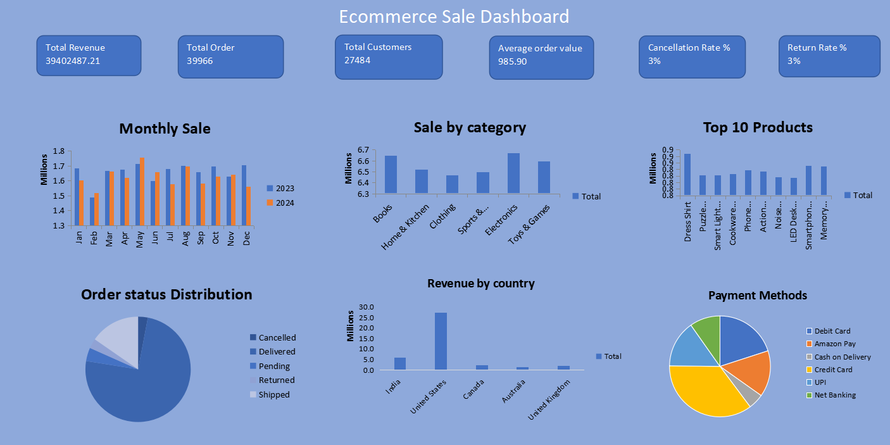

# Ecommerce Sales Performance Dashboard (Excel)

## 📌 Project Overview
An interactive Excel data analytics project designed to track, analyze, and visualize key performance indicators (KPIs) for an international e-commerce business across multiple operational metrics (2023–2024).

## 📊 Dashboard Preview

## 🔑 KPIs & Analysis Included
* **Total Revenue:** Total gross monetary value generated from completed sales.
* **Total Order:** Gross count of all orders placed across the platform.
* **Total Customers:** Unique customer count driving transactional volume.
* **Average Order Value (AOV):** Average amount spent per transaction.
* **Cancellation Rate %:** Percentage of orders canceled prior to fulfillment.
* **Return Rate %:** Percentage of delivered orders sent back by customers.

## 📈 Visual Breakdowns & Trends
* **Monthly Sales Trend:** Chronological performance overview tracking sales variations over time.
* **Sales by Category:** Sector breakdown showing revenue distribution across major product groups.
* **Top 10 Products:** High-utility identification of the highest revenue-generating inventory items.
* **Order Status Distribution:** Operational breakdown analyzing fulfillment rates (Delivered, Pending, Canceled).
* **Revenue by Country:** Geographical performance breakdown highlighting top international consumer markets.
* **Payment Method Analysis:** Structural breakdown tracking customer transaction preferences (Cards, UPI, Cash).

## 🛠️ Technical Skills Demonstrated
* **Data Visualization & Dashboard UI Design:** Designed a cohesive interface with clean custom axis metrics in Millions (`M`).
* **Pivot Tables & Pivot Charts:** Aggregated large transactional data sets dynamically across dates, regions, and categories.
* **Data Cleansing:** Standardized text string errors and sorted custom date hierarchies chronologically.
